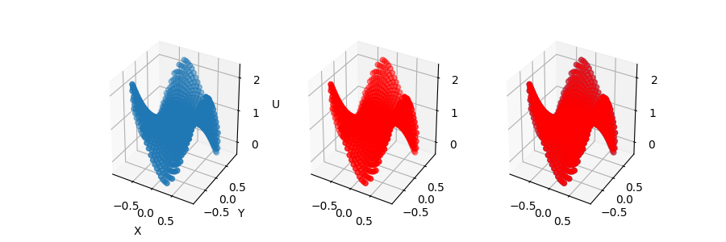
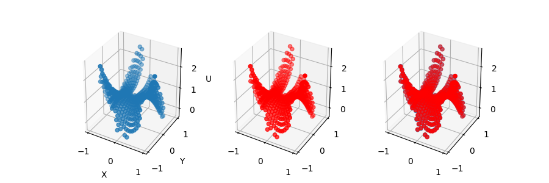

\newcommand{\R}[0]{\mathbb{R}}
\newcommand{\N}[0]{\mathbb{N}}


## Background Info

### Laplace's Equation

A very important and fundamental equation
in differential equation problems is Laplace's Equation.
A function $f$ on a domain $\Omega$ is said to satisfy Laplace's Equation if
$\nabla^{2}f=0$.

We also care about Laplace's Problem, wherein we are given a domain $\Omega$
and a function $g$ on $\partial\Omega$.
Laplace's Problem is then to find a function $u$
that satisfies Laplace's Equation and is equal to $g$ on $\partial\Omega$.

Oftentimes, it helps to define Laplace's Equation explicitly,
within some fixed coordinate system.
In particular, we care about Cartesian coordinate
representation of Laplace's Equation:

$$\left(\frac{\partial^{2}}{\partial x^2}
+\frac{\partial^2}{\partial y^2}\right)u=0$$

Laplace's Equation is used in many contexts and fields,
for modelling many different physical models.
For example, it can be used to model steady states for heat diffusion.

As such, many methods exist for solving Laplace's Equation.
One way of solving it in practice is Green's functions.
However, these are not practical to compute,
especially with uneven domain boundaries,
so this approach is not very applicable.

There are thus many numerical methods for this problem,
even for irregular boundaries.
However, we are going to focus on a specific approach,
based on the theory of stochastic differential equations.

### The Feynman-Kac Formula

Analogously to the theory of PDEs, there is a theory of stochastic differential equations (SDEs). Two fundamental concepts in the theory of SDEs are Brownian motion and Ito's formula.

Brownian motion $B(t)$, also known as a Wiener process, is a continuous stochastic process which has the property that $E(B(t)) \sim N(0, t)$ for all times $t \geq 0$; i.e. it is the set of all random walks centered about the origin, distributed normally with a variance equal to $t$ [@roberts2009elementary]. We denote by $E^x(B(t))$ the expectation of Brownian motion which begins from position $x$ instead of the origin. 

Ito's formula is the SDE analogue of the chain rule. As a consequence of Ito's formula, we can derive the Feynman-Kac formula, which relates a family of PDEs with the Expectation of a Wiener process. For Laplace's equation, the formula becomes

$$u(x) = E^x [g(\textbf{B}(T))]$$

where $g$ is the same as in the formulation of the Laplace equation above [@chati2001random]. The result is an algorithm which can produce a local solution $u$ at any point $x \in D$, which is not coupled to the solution at other points in $D$, and which is highly parallelizable.

The Expectation of a stochastic process is hard to compute analytically. However, it is pretty easy to simulate numerically, using a pseudorandom number generator. By the Law of Large Numbers, the sample mean will approach the Expectation at a rate of $\frac{1}{\sqrt(K)}$, where $K$ is the number of samples.

In brief, to solve for $u$ at the point $x$, we may perform the following steps:

1. Choose some time-step size $dt$. Simulate a particle performing a random-walk starting from $x$ with time-step size $dt$.

2. Repeat step 1 until the particle moves outside $D$ at the terminal time $T$, at which point we add the value of $g(x(T))$ to the total.

3. Simulate $N$ more particles, and keep track of the total in each simulation.

4. Take the mean of the simulation totals. As $N \rightarrow \infty$, this value approaches the value of the solution $u(x)$.

Other authors have written about theoretical aspects of this or similar problems at an accessible level: Reynolds gives a proof that a random walk on a Cartesian grid can be used to solve Laplace's [@reynolds1965proof], while Lawler gives an exposition relating the 1D Heat equation to SDEs [@lawler2010random].

## Some previous work on the problem.

Generally speaking Laplace's problem has been tackled from a number of angles. For example, we can use finite elements to solve Laplace's. Here is a link to one such program (fenics).

We based a significant amount of our work on Chati et al., who did a random walk method for Laplace's and Poisson's. A quick search of related work turns up a body of "SDE" or stochastic solution methods. Here are two titles I happened to understand: "Solution of BVPs in electrodynamics by stochastic methods", and "Random Walk Method for Potential Problems".

We should talk a little more about coupling. We decided to introduce coupling in our work, based on discussions with our professor (that's you, the reader). Our coupling approach is based on a standard finite-difference method. More on this in discussion.

There's also some cost-savings work in walk-on-spheres, but we didn't look into this.

## Implementing A Random Walk

### The Basic Method

For the random walk method,
we first begin by choosing the points we wish to simulate.
For each of those points, we then start simulating random walks,
by taking steps with Gaussian random noise.
Each random walk runs until it hits the boundary.
When it does, we evaluate the function on that boundary.

For each point, we perform $K$ random walks.
Then, we average the values of the function evaluations
for random walks from that point.
This averaging is the discrete equivalent of the expectation value above,
so in expectation, this gets us the value of the solution at that point.
Thus, by doing sufficiently many random walks,
we get a good unbiased estimator for the solution of the Laplacian.
And with sufficiently many random walks,
we closely can approximate the actual solution.

### The Finite Difference Modification

However, the above method has several flaws.
Notably, a random walk takes a lot of time to converge.
Furthermore, work is not reusable between points.
After solving the problem at many points,
solving the problem an another point
requires running many random walks all over again.

To avoid this, we can use finite differences
to vastly cut down on the amount of random walks we have to perform.

We begin by constructing a mesh of points within our desired boundary,
with distances between points equal to a parameter $h$.
Each point will then have 4 neighbours, the points closest to it,
one in each direction.

We classify the points within the mesh into two groups:
*interior points* and *boundary points*.
Interior points are those with four neighbours which lie within the boundary,
while boundary points are those that lie within the boundary
but which have a neighbour which lies outside the boundary.

Now, when we perform our random walks,
we only perform them on the boundary points.
We can thus obtain a good estimate
for the values of the function at the boundary points.

For the interior points, we can then just use finite differences.
We will have a sparse system,
where each interior point is entangled with at most 4 other interior points,
as well as at most 4 boundary points,
which contribute to the target values.
This lets us find all the values of the interior points
with a single linear solve,
allowing us to neatly avoid
having to perform random walks on all of those points.

The benefits of this are two-fold.
First of all, note that this reduces, asymptotically,
the amount of random walks we have to perform.
If our grid were to have spacing $h$ between the nodes,
then we would originally need to perform $O(Kh^{-2})$ random walks
(assuming a nice boundary),
since the amount of points grew as $h^{-2}$.
But by only performing the walks on the boundary points,
we cut this down to $O(Kh^{-1})$,
which can lead to huge savings.

Furthermore, note that boundary points are within $h$ of the boundary,
just by their definition.
Thus, the amount of steps necessary for a random walk to converge
should take less time for boundary points than interior points.
So many walks will converge much faster.

### The coupled set of equations.

However, the random walks can still take a while to converge.
If a random walk at a boundary point,
it can still randomly walk into the centre of the region,
and could thus take a while to actually reach the boundary.

To avoid this, we can stop our walks early if they reach the boundary.
If the random walk reaches a boundary point,
then the expectation value of that random walk
is the same as the expectation value of random walks from that boundary point.
Thus, there is no need to continue the random walks.

In practice, this can be implemented in two ways,
in an explicit or an implicit way.
We run the random walks until we hit the boundary or another boundary point.
We can then use the resulting numbers in two ways.

We can index a vector based on our boundary points,
creating a vector $\R^{B}$, where $B$ is the number of boundary points.
This lets us assign a real number to each boundary point.
Let $b_i$ be the total of the values of random walks starting at a given point $i$.

Normally, we then set $u = \frac{1}{K}b$.
This lets us solve the system directly.

Now, let $F\in\N^{B\times B}$ be a matrix of integers.
$F_{i,j}$ is the number of random walks
which start at the boundary point $i$ and end at the boundary point $j$.

The explicit way of finding $u$ is then
by taking $u=\frac{1}{K^2}Fb + \frac{1}{K}b$.
This lets us find $u$ explicitly.

We can also use an implicit form.
We can take $u=\frac{1}{K}Fu + \frac{1}{K}b$.
This requires solving a linear system,
and usually performs better than the above.

### The random walk, and boundary detection.

Overview.
The covariance matrix of the 2D gaussian is the identity. At each step we can just sample from this.

Here is some python. It's pretty simple because I abstracted away all of the details.

```python
```

#### Some details: boundary detection.

There are some subtle problems that arise from using coupled random walks.

First, we should notice that points can cross the boundary at any point between boundary points. In this case, which frequency should we update?

We decided to update the frequency of the closer of the two nodes. Something we didn't try: use fractional frequency updates based on a linear interpolant (similar to hard vs. soft k-means).

Second, random walks are discrete, so they can 'tunnel' through the boundary.

We decided to create a 'thickness' to the wall, but only on the interior-facing boundary. The thickness of the wall is such that 95% of all points starting from a boundary node will not tunnel past the wall (based on the standard deviation of the random walk).

We throw out points that go past the wall.

Something we didn't try: interpolating between successive point positions to check for a boundary collision. Based on our setup, it seems expensive.

### Other things we didn't try.

Another method for speeding up these random walks for Laplace's Problem
is to use *walk-on-spheres*.
Note that because the Laplacian is 0 on this region,
the individual steps of the random walk are identical,
except that they end up at different points.
And if we start at a given point,
if a ball of radius $R$ around that point fits within the boundary,
then a random walk has an equal probability
of ending on any point of that circle,
after every amount of steps.
Thus, we can skip a lot of steps,
and just jump to a random point on the ball.
This lets us cut down on the number of steps required,
thus vastly speeding up the algorithm.
However, we did not apply this,
as we wanted our algorithm to be more generalizable
to Poisson's Problem.

Another approach we did not use was the boundary-within-a-boundary approach.
Here, we construct another boundary on the inside of the boundary points.
Then, we can couple our boundary points with the points on this inner boundary,
which lets us cut the random walks off faster.
However, then we need to find the values on the inner boundary points.
This causes us to incur some costs to find those.

The end result of extending this is to fully couple all our points.
Now, we no longer even use our discretization of the Laplacian.
Instead, we can now fully couple both our boundary points and interior points,
which would then result in a much more dense linear system.
Solving this system would be more complicated than before,
but it would mean that we could take sufficiently fewer random walk steps.

## Performance

We ran several tests for the performance of this algorithm.

First, we considered the accuracy of this algorithm.
We ran tests on the example function $g(x,y)=x^3-3xy^2-3x^2y+y^3$.
This function satisfies Laplace's Equation,
meaning we have a target value for $u(x,y)$.

From this, we ran the above procedure to obtain values on the unit disk.
We could also calculate the values on that unit disk explictly.
From this, we could then calculate the maximum absolute error.

These runs did not use coupling,
and used constant steps for the random walks of length $0.001$.

The results are listed in the table below.
Each entry is the maximum absolute error obtained by running the algorithm
with that spacing, and with that amount of random walks.

$K \backslash h^{-1}$ | 25 | 50 | 100
--- | --- | --- | ---
25 | 0.14277 | 0.12212 | 0.11857
100 | 0.09681 | 0.07336 | 0.06178
400 | 0.03782 | 0.02709 | 0.03108
1600 | 0.01406 | 0.01657 | 0.01441

We also have the mean absolute error.

$K \backslash h^{-1}$ | 25 | 50 | 100
--- | --- | --- | ---
25 | 0.010997 | 0.006750 | 0.004682
100 | 0.011937 | 0.005103 | 0.003368
400 | 0.004551 | 0.001876 | 0.001779
1600 | 0.001479 | 0.001157 | 0.000858

In both cases, the error can be seen to decrease with $h$
and to decrease as $K$ increases.
However, the step from $25$ steps to $100$
doesn't seem to decrease the error significantly.
It appears that this number of steps just isn't significant for convergence.
The error is also linear in $h$,
with the exception of $K=400$ and $h^{-1}=100$.

We also analysed the runtime,
run on the same set of values of $K$ and $h$.
This is organized into three tables.
The first lists the runtime of the simulation steps,
the second lists the time to do the subsequent linear solve,
and the third lists the total runtime.
All times are listed in seconds.

$K \backslash h^{-1}$ | 25 | 50 | 100
--- | --- | --- | ---
25 | 1.454 | 1.963 | 4.004
100 | 6.268 | 8.477 | 25.817
400 | 23.231 | 35.812 | 68.748
1600 | 91.341 | 127.997 | 217.419

$K \backslash h^{-1}$ | 25 | 50 | 100
--- | --- | --- | ---
25 | 0.653 | 2.278 | 18.498
100 | 0.877 | 2.252 | 9.256
400 | 0.589 | 2.979 | 10.776
1600 | 0.628 | 2.415 | 10.337

$K \backslash h^{-1}$ | 25 | 50 | 100
--- | --- | --- | ---
25 | 2.107 | 4.240 | 22.503
100 | 7.146 | 10.728 | 35.0722
400 | 23.820 | 38.791 | 79.524
1600 | 91.969 | 130.412 | 227.759

The different parts scaled differently.
The linear system solve was independent of $K$, as expected,
since it happens after the simulation.
And it scaled roughly as $h^{-2}$.
This makes sense as we have $h^{-2}$ points overall,
and we are solving a sparse linear system.

The simulation steps scaled linearly in $K$, as expected.
It also scaled roughly linearly in $h^{-1}$.
This is as expected, as the number of boundary points
grows roughly linearly in $h^{-1}$.
Note that because the random walks take random amounts of time,
the resulting times are also random,
and have a pretty high variance.

We also ran some tests with a much more uneven domain.
This one was defined by a very heavily oscillatory set of sinusoidals,
resulting in a very uneven boundary.

The maximum errors of those runs are listed below.

$K \backslash h^{-1}$ | 25 | 50
--- | --- | ---
25 | 0.17144 | 0.14691
100 | 0.07071 | 0.08459
400 | 0.03723 | 0.03352

We also have the mean absolute error.

$K \backslash h^{-1}$ | 25 | 50
--- | --- | ---
25 | 0.024012 | 0.021978
100 | 0.013124 | 0.010827
400 | 0.007766 | 0.004791

As can be seen, while the mean errors did decrease slightly with $h^{-1}$,
there was not a large decrease in the error in $h^{-1}$.
Instead, the most notable decrease was with $K$,
where it appeared to decrease as $\frac{1}{\sqrt{K}}$.

We also analysed the runtime, just as before.

$K \backslash h^{-1}$ | 25 | 50
--- | --- | ---
25 | 31.307 | 51.238
100 | 144.183 | 216.124
400 | 556.048 | 910.414

$K \backslash h^{-1}$ | 25 | 50
--- | --- | ---
25 | 0.323 | 1.187
100 | 0.357 | 1.110
400 | 0.414 | 1.110

$K \backslash h^{-1}$ | 25 | 50
--- | --- | ---
25 | 31.630 | 52.425
100 | 144.539 | 217.234
400 | 556.462 | 911.524

Again, the linear solve grew as roughly $h^{-2}$,
which makes sense, just as before.
The runtime of the random walks also took time roughly proportional to $K$.

However, the random walks also took time proportional to less than $h^{-1}$.
And they took much more time than on the circular domain.
The probable reason for that is the unusual domain.
Near the centre, boundary points are very close to boundaries,
but most random walks do not quickly converge to the boundary.
Instead, because the boundary is a very thin slice,
most random walks take a lot of time.
This means that points near the centre take a long runtime,
meaning that the newer points don't add that much time,
in comparison.

## Some figures and results.
Results. Figure @fig:random-walks shows 10 random walks on the unit disk starting from a boundary point, both with and without coupling.

{#fig:random-walks}

Figure @fig:squiggly-domain plots the level set of our irregular domain, as well as our Cartesian mesh for $N=40$.

{ width=290px  #fig:squiggly-domain}

Figure @fig:results-circle and @fig:squiggly plot the numerical and exact solutions for the disk and the irregular domain. We did not use coupling to compute the numerical solution because of its poor performance on the unit disk. Table 3 shows the error for the irregular domain.

{#fig:results-circle}


{#fig:squiggly}

## Conclusions.

We have now seen that we can use random walks to solve Laplace's Problem.
While the performance is not the best,
we still get pretty good results.
The algorithm takes a lot of time to converge,
which means that in practice, it is not very efficient.

## Future Directions.


## Contributions.

Caroline wrote the random walk code and generated the figures in the results section. Dmitry wrote the finite difference code and profiled the algorithm in time and error. 
Both members of the group contributed to the overall decision-making for this project.

# References
